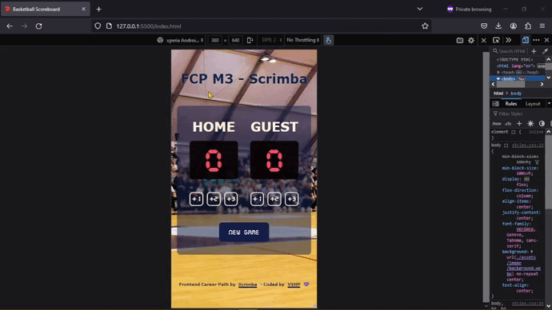
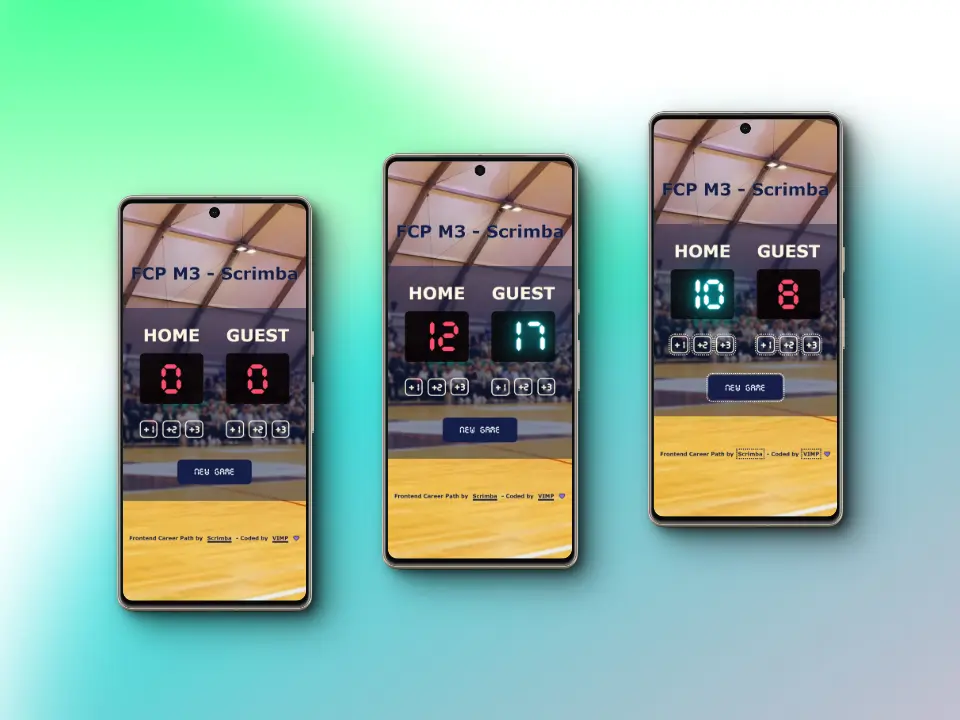
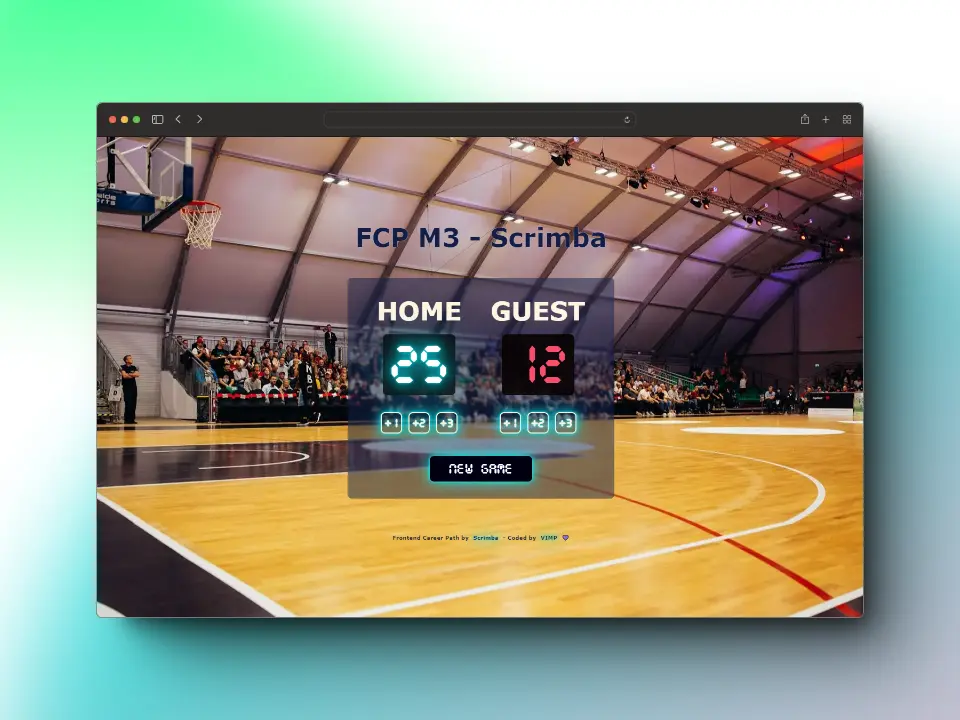

# Basketball Scoreboard - Solo Project

This is my solution to the **Solo project: Basketball Scoreboard** of the course [Frontend Career Path](https://scrimba.com/learn/frontend) by [Scrimba](https://scrimba.com/)



### Table of contents

+ [The challenge](#the-challenge)
+ [Screenshots](#screenshots)
+ [Links](#links)
+ [Built with](#built-with)
+ [What I learnt](#what-i-learnt)
+ [Useful resources](#useful-resources)
+ [Author](#author)

## *The challenge*
🎯 Build from 'scratch'

🎯 Follow the design

🎯 Make all six buttons work

#### *Stretch goals*:

🎯 Add a 'New Game' button

🎯 Highlight the leader

🎯 Change the design

## *Screenshots*
#### 📱 Mobile



#### 💻 Desktop



## *Links*
[Live Site](https://mendez-v.github.io/basketball-scoreboard/) 👀

[Scrim URL](https://scrimba.com/scrim/c2vdzbhw) 👀

[Frontend Career Path projects](https://github.com/mendez-v/frontend-career-path) 👀

## *Built with*
✅ Mobile-first workflow

✅ Semantic HTML markup

✅ Custom properties

✅ Utility classes

✅ Flexbox

✅ CSS Grid

## *What I learnt*

📌 Refactoring functions: `add1Home`, `add2Home`, `add3Home`, `add1Guest`, `add2Guest`, `add3Guest`; have almost the same code

```js
let hCount = 0
function add1Home() {
  hCount +=1
  hScore.textContent = hCount
  greater(hCount, gCount)
}
function add2Home() {
  hCount += 2
  hScore.textContent = hCount
  greater(hCount, gCount)
}
function add3Home() {
  hCount += 3
  hScore.textContent = hCount
  greater(hCount, gCount)
}

let gCount = 0
function add1Guest() {
  gCount += 1
  gScore.textContent = gCount
  greater(hCount, gCount)
}
function add2Guest() {
  gCount += 2
  gScore.textContent = gCount
  greater(hCount, gCount)
}
function add3Guest() {
  gCount += 3
  gScore.textContent = gCount
  greater(hCount, gCount)
}
```
🧨 In this code, I have created two additional functions: `addPointsHome` and `addPointsGuest`. These functions take a number of points as an argument and add those points to the corresponding team's score. Then, the functions `add1Home`, `add2Home`, `add3Home`, `add1Guest`, `add2Guest`, and `add3Guest` call these functions with the correct number of points.

```js
function addPointsHome(points) {
  hCount += points
  hScore.textContent = hCount
  greater(hCount, gCount)
}
function addPointsGuest(points) {
  gCount += points
  gScore.textContent = gCount
  greater(hCount, gCount)
}

function add1Home() {
  addPointsHome(1)
}
function add2Home() {
  addPointsHome(2)
}
function add3Home() {
  addPointsHome(3)
}

function add1Guest() {
  addPointsGuest(1)
}
function add2Guest() {
  addPointsGuest(2)
}
function add3Guest() {
  addPointsGuest(3)
}
```

📌 Refactoring the ***greater*** function using the `toggle` method. 

  > `toggle` method, adds the class if the second argument is true and removes it if it is false.
```js
// UNFACTORIZED
function greater(a, b) {
  if (a > b) {
    hScore.classList.add('neon')
    gScore.classList.remove('neon')
  } else if (b > a) {
    gScore.classList.add('neon')
    hScore.classList.remove('neon')
  } else {
    hScore.classList.remove('neon')
    gScore.classList.remove('neon')
  }
}

// FACTORIZED
function greater(home, guest) {
  hScore.classList.toggle('neon', home > guest)
  gScore.classList.toggle('neon', guest > home)
}
```

## *Useful resources*

🔰 `toggle` method by [MDN](https://developer.mozilla.org/en-US/docs/Web/API/Element/toggleAttribute)

🔰 [Neon title](https://www.youtube.com/watch?v=LOtvgJIbpow) by Chuche Mirabelli

🌈 Photo by <a href="https://unsplash.com/@markusspiske?utm_content=creditCopyText&utm_medium=referral&utm_source=unsplash">Markus Spiske</a> on <a href="https://unsplash.com/photos/people-inside-a-basketball-gym-J_tbkGWxCH0?utm_content=creditCopyText&utm_medium=referral&utm_source=unsplash">Unsplash</a>

🌈 Favicon <a href="https://iconscout.com/icons/basketball" class="text-underline font-size-sm" target="_blank">Basketball</a> by <a href="https://iconscout.com/contributors/andinur" class="text-underline font-size-sm" target="_blank">Andinur Studio</a>

## *Author*

✨ Frontend Mentor - [@mendez-v](https://www.frontendmentor.io/profile/mendez-v)
