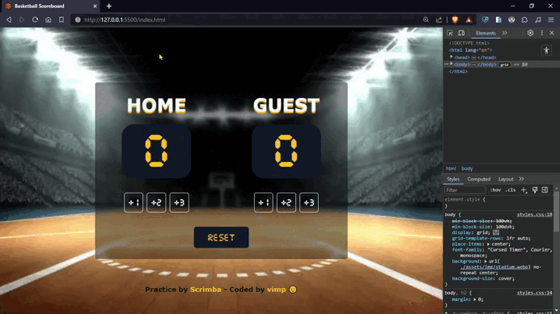
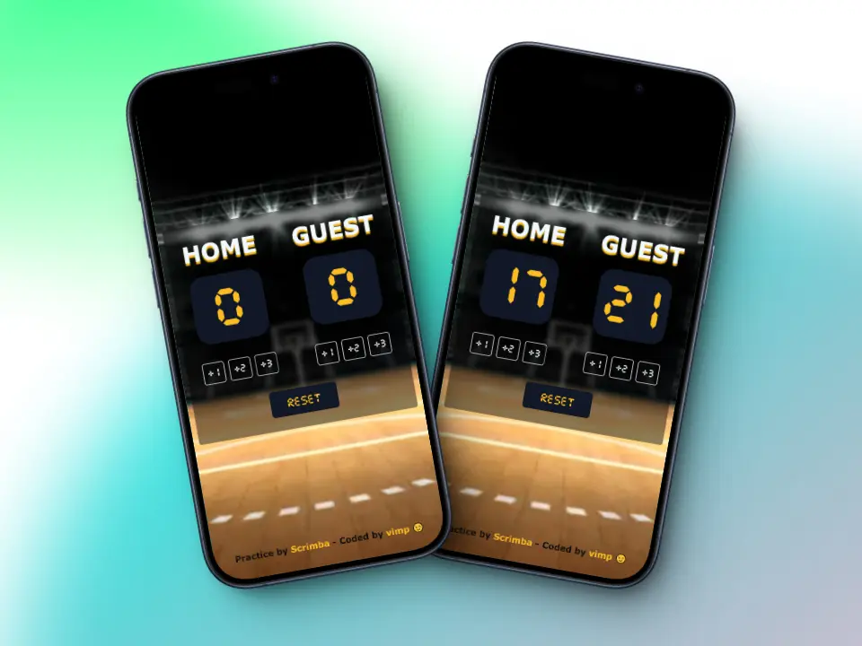
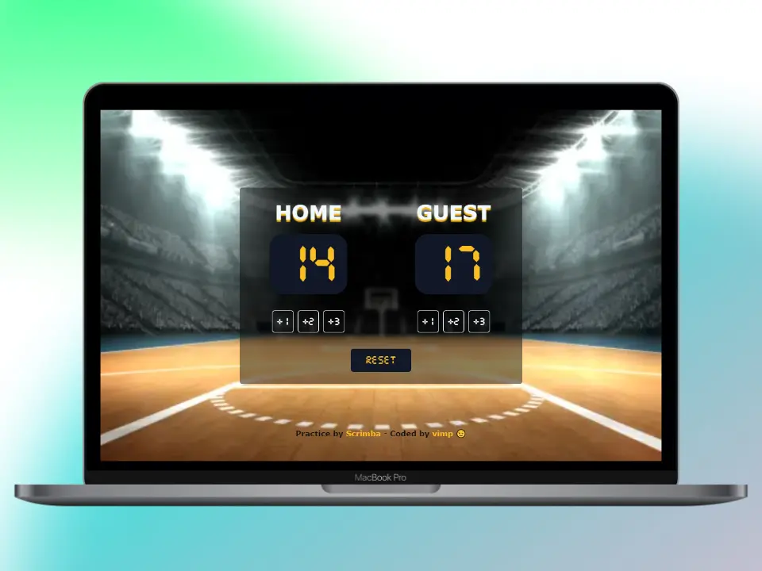

# Basketball Scoreboard

This is a solution for the project: **"Basketball Scoreboard"** of the ["Learn JavaScript"](https://scrimba.com/learn/learnjavascript) course by [Scrimba](https://scrimba.com/).

## 📱 Mobile

## 💻 Desktop

## Demo

✨ Want to have a look?, [click here](https://vanmendez.github.io/basketball-scoreboard/) 👀

## Resources

🏀 [Basketball](https://iconscout.com/icons/basketball) by [Andinur Studio](https://iconscout.com/contributors/andinur) on [IconScout](https://iconscout.com)

🖼 Image by [Prexels](https://www.pexels.com/)
